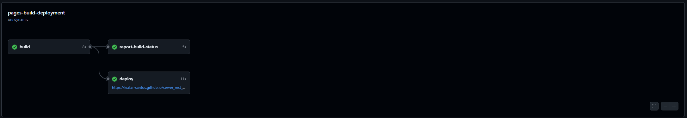
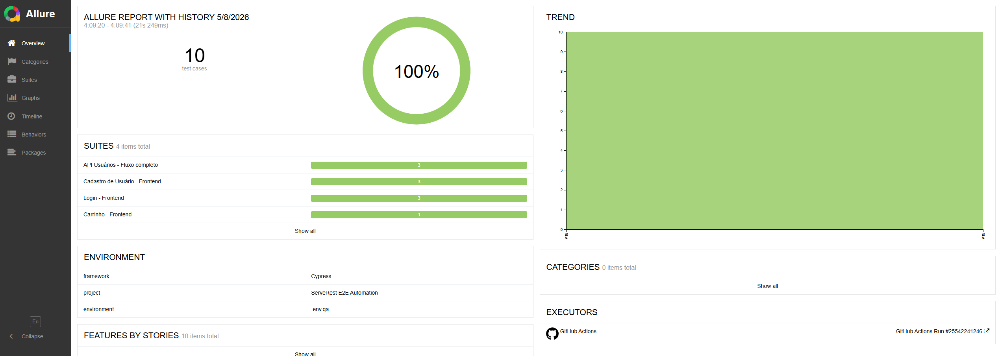
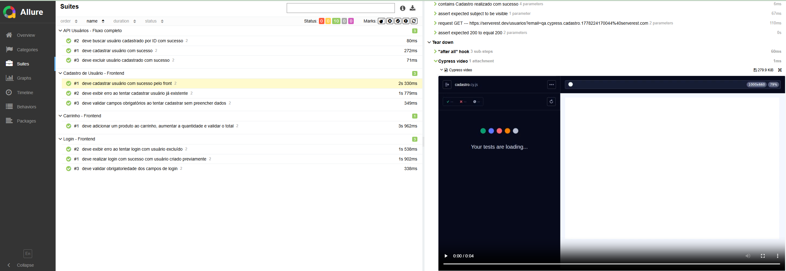
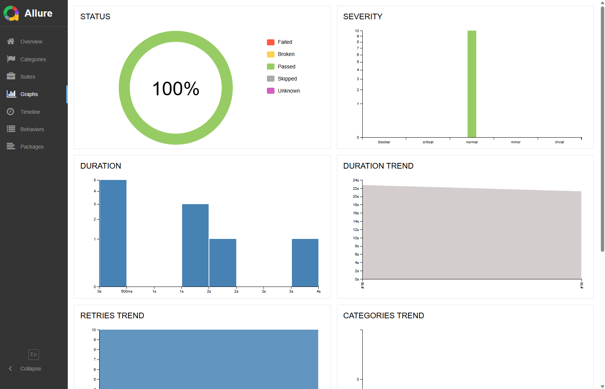
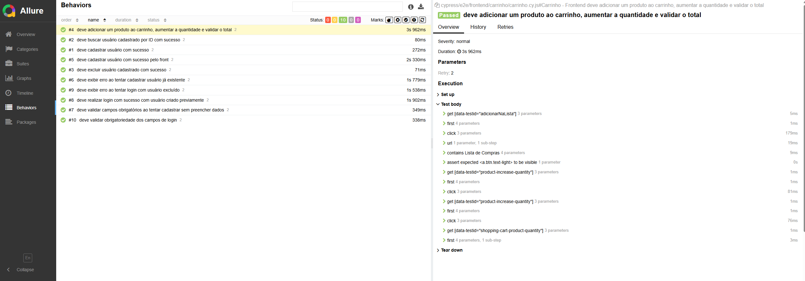

# ServerRest E2E e API Automation

Framework de automação de testes frontend e API desenvolvido com Cypress e TypeScript.

O objetivo do projeto é validar fluxos E2E e APIs REST utilizando uma arquitetura organizada, reutilizável e preparada para CI/CD.

---
# Tecnologias utilizadas

- Cypress
- TypeScript
- Allure Report disponível na seção about no git
- GitHub Actions
- Node.js
- npm
- dotenv
- cross-env
---

# Arquitetura

O projeto foi estruturado utilizando separação por responsabilidades para facilitar manutenção e escalabilidade da suíte.

```text
cypress/
├── api/
│   ├── assertions/
│   └── services/
│
├── frontend/
│   ├── actions/
│   ├── assertions/
│   ├── intercepts/
│   ├── pages/
│   └── selectors/
│
├── e2e/
│   ├── api/
│   └── frontend/
│
├── fixtures/
├── shared/
└── support/
```

## Por que essa arquitetura?

A separação em camadas evita acoplamento entre testes, seletores, regras e requisições.

Com isso, o projeto fica:

- mais legível;
- mais reutilizável;
- mais simples de manter;
- preparado para crescimento da suíte.

---

# Funcionalidades implementadas

## Frontend

- Login
- Cadastro de usuário
- Carrinho
- Sessions com `cy.session()`
- Intercepts
- Retry inteligente

## API

- Cadastro de usuário
- Consulta de usuários
- Busca por ID
- Exclusão de usuário
- Consulta de produtos

---

# Integração contínua

O projeto possui pipeline configurada no GitHub Actions para:

- Execução automatizada dos testes;
- Geração do relatório Allure;
- Publicação das evidências.



---

# Relatórios Allure

O projeto possui integração com Allure Reports para geração de evidências automatizadas.

## Exemplos

### Dashboard



### Execução dos testes



### Evidências e steps



### Trends e métricas



---

# Execução do projeto

## Instalar dependências

```bash
npm install
```

---

## Executar frontend + API

```bash
npm run cy:run:qa
```

---

## Executar apenas API

```bash
npm run cy:run:api:qa
```

---

## Executar apenas frontend

```bash
npm run cy:run:frontend:qa
```

---

# Gerar relatório Allure

```bash
npm run test:allure:qa
```

---


